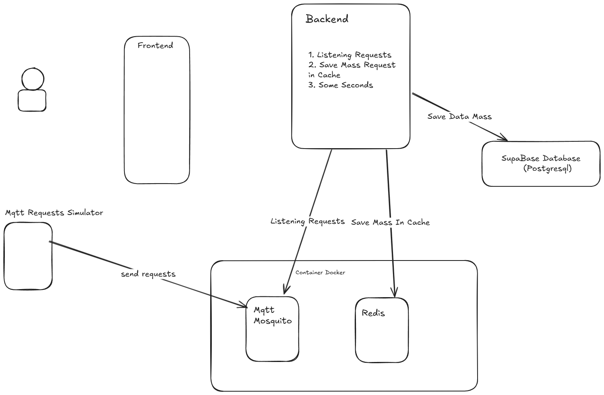
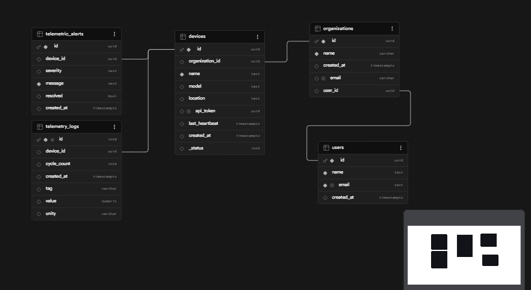

# 📡 Sistema de Telemetria e Monitoramento Industrial

O **Sistema de Telemetria** é uma plataforma focada no monitoramento e gerenciamento de dispositivos industriais. O sistema oferece aos gestores uma visão geral da operação do parque de dispositivos, separada por organizações, permitindo também o acompanhamento detalhado em tempo real do funcionamento, status e necessidade de manutenção dos equipamentos.

---

## 🛠️ Tecnologias Utilizadas

O projeto foi construído utilizando tecnologias modernas para garantir performance, escalabilidade e comunicação em tempo real:

* **Frontend:** Next.js 16, Tailwind CSS, NextAuth.js
* **Backend & Comunicação:** .NET, MQTT Broker, WebSocket, Redis
* **Infraestrutura & Banco de Dados:** Docker (Containers), Supabase (PostgreSQL, Autenticação)

---

## 🏗️ Arquitetura

Abaixo está a representação visual da arquitetura de comunicação e ingestão de dados:

---

## 💾 Base de Dados

Base de Dados para facilitar a comunicação e ja ter algo preparado usamos Subabase que já possui banco de dados integrado (PostgreSQL)

---

## 💡 Pontos e Destaques Técnicos

- **Gestão de Sessão (NextAuth):** Gerenciamento seguro de sessão de usuários no Frontend.
- **Comunicação de Dispositivos (MQTT):** Uso do protocolo MQTT (integrado a um Broker) voltado para internet das coisas para absorver e transmitir dados dos equipamentos de forma leve e eficaz.
- **Atualizações em Tempo Real (WebSocket):** Interface viva utilizando WebSockets (com sistema de token próprio para segurança da conexão WS).
- **Uso do Redis:** Implementado no backend para cache, filas ou gerenciamento otimizado de dados em tempo real.
- **Containerização (Docker):** Aplicação rodando e orquestrada de forma isolada em containers.
- **Supabase as a Service:** Utilizado tanto para estruturação do banco de dados (PostgreSQL) quanto para o sistema de Autenticação.
- **Autenticação Dupla no Backend:** O sistema utiliza duas estratégias de autenticação simultâneas:
  1. Autenticação padrão (REST HTTP)
  2. Autenticação adequada e focada para Conexões em Tempo Real (WebSocket/MQTT).

---

## 📋 Requisitos Funcionais

- [x] **Gestão de Entidades:** Criar, editar, listar e remover Organizações e Dispositivos.
- [x] **Visão Geral (Dashboard):** Tela de visualização geral e agrupada dos dispositivos de acordo com as suas respectivas organizações.
- [x] **Visão Detalhada:** Permitir ao usuário entrar no detalhamento individual de cada dispositivo para observar seu status, telemetria e operação.

---

## ⚙️ Requisitos Não Funcionais

- **Segurança:** O sistema deve suportar e exigir a autenticação segura de usuários.
- **Protocolo IoT:** A comunicação dos dispositivos com o backend deve ser feita obrigatoriamente através do protocolo MQTT, alinhado ao seu Broker.
- **Persistência de Dados:** O sistema deve estruturar e persistir os dados relacionais e eventos em um banco de dados estruturado PostgreSQL.

## 🎓 Pontos Chave

* Nesse Projeto com uso de Cache os dados não precisaram ser cadastrados um a um no Banco de Dados, para melhor performance foi colocando um timer para registrar os dados em massa no banco de Dados.
